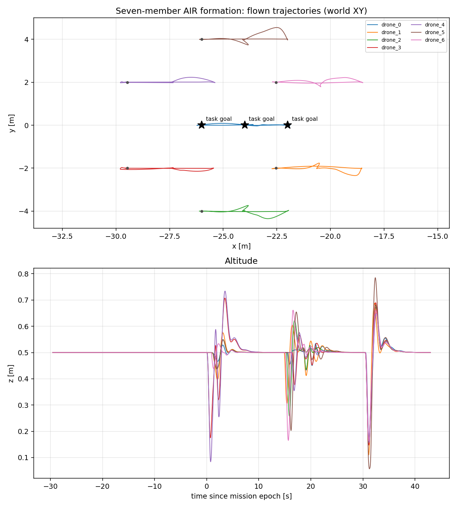
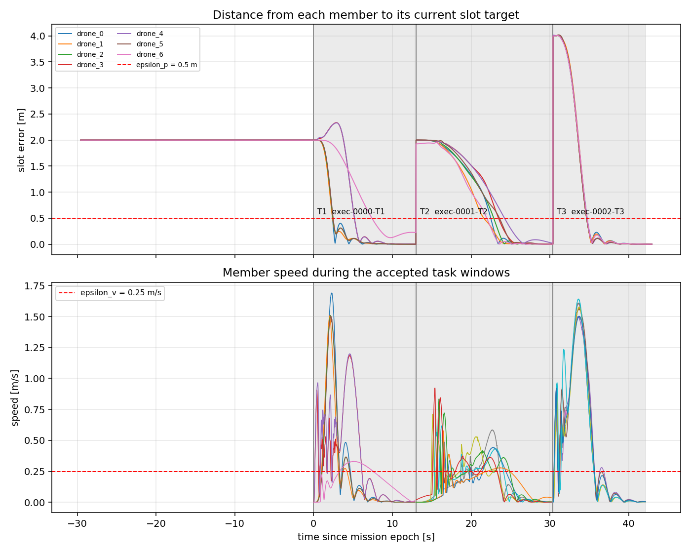
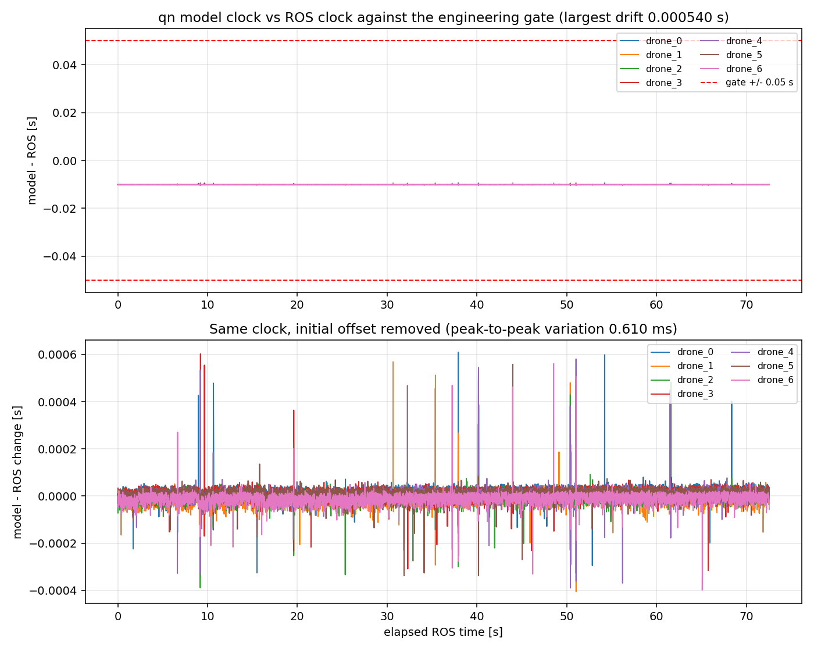

# qn integration

The upstream Swarm-Formation planner, optimizer, map, swarm graph, messages, and trajectory
server are unchanged. The platform boundary is replaced as follows:

```text
quadrotor_msgs/PositionCommand
  position, velocity, acceleration, yaw, yaw_dot
                    |
                    v
qn original RBF/PD controller
                    |
                    v
10 first-order actuators
                    |
                    v
qn 6DOF AIR/TRANSITION/WATER plant
                    |
                    v
nav_msgs/Odometry + medium_flag
                    |
                    v
Swarm-Formation planner feedback
```

The upstream source remains under `upstream/Swarm-Formation`. During the qn image build,
`integration/swarm_qn_bridge/simulator.xml` overlays the upstream simulator launch and replaces
`poscmd_2_odom` with `qn_aav_simulator/qn_aav_node.py`, preserving the command and odometry remaps.

The qn numerical equations are copied from the previously validated Python transcription:

- `integration/qn_aav_simulator/src/qn_aav_simulator/qn_dynamics.py`
- `integration/qn_aav_simulator/src/qn_aav_simulator/qn_python_backend.py`
- `integration/qn_aav_simulator/src/qn_aav_simulator/contracts.py`

Only the runtime-evaluated `tuple[...]` type aliases were changed to `typing.Tuple[...]` for ROS
Noetic's Python 3.8. No numerical equation, controller parameter, saturation, or integration rule was
changed.

The active backend contract is `ROUTE_POSITION`, `QN_ORIGINAL_POSITION`, and
`QN_ORIGINAL_RBF_PD`. The historical `LOS_SURGE_YAW` branch is not active. The original
`models/qn/qn.slx` is retained as the source model; MATLAB is not required at runtime.

This first reproduction keeps the official demo in its AIR operating region. Swarm-Formation's
`max_vel` and `max_acc` constraints do not model hydrodynamic drag, buoyancy, actuator envelopes,
or medium transition cost, so cross-medium formation flight is not yet claimed.

## Build and run

```bash
cd ~/Swarm-Formation
./scripts/docker_build_qn.sh
./scripts/docker_test_qn_single.sh
./scripts/docker_run_qn_demo.sh
```

After RViz opens and the seven qn nodes report ready, use `2D Nav Goal` to select the formation
destination, exactly as in the upstream demo.

The upstream `normal_hexagon.launch` actually starts IDs 0 through 6: one center member and six
hexagon members, so the current demo contains seven qn-controlled AAVs.

## Verified boundary

- The unmodified upstream image builds all 18 official catkin packages.
- The qn image builds 19 packages, adding only `qn_aav_simulator`.
- A single qn AAV given an x reference of 0.2 m reached x=0.177 m after four seconds. The state
  was dynamically integrated rather than copied from PositionCommand.
- The official normal-hexagon launch started all seven planner, trajectory, sensing, visualization,
  and qn nodes. After a goal was published, drone 0 moved from x=-26.0 m to x=5.06 m in 20 seconds.
- In a complete run to a clicked center target of `(20, 0, 0.5)` m, all seven qn Odometry states
  reached their assigned center-plus-hexagon slots. The maximum final position error was about
  0.00062 m.

This validates the software, nominal AIR execution chain, and final formation position. It does not
yet validate minimum obstacle clearance under qn tracking error, actuator saturation margins, or
cross-medium formation flight.

## Odometry semantics after the task-layer integration

The qn node publishes two odometry streams from **one** state snapshot. They are
not interchangeable and are separated so a single topic never carries two
coordinate conventions:

```text
/drone_i_qn/odometry                    frame world, child drone_i/base_link
    pose  = world position and attitude
    twist = linear velocity in the BODY frame, angular velocity in the BODY frame
            (the qn plant's own body rate, published without transformation)

/drone_i_qn/odometry_swarm_compat       remapped to /drone_i_visual_slam/odom
    frame world, child drone_i/swarm_compat
    twist.linear = the world-frame velocity the unchanged Swarm planners
                   already consumed; explicitly a Swarm compatibility input,
                   not a general ROS Odometry
```

Generic ROS consumers read only the standard topic. `swarm_qn_bridge/simulator.xml`
remaps `~odometry_swarm_compat` onto the topic the Swarm planners subscribe to, so
the upstream planners need no change. A verifier check reconstructs the relation
between the two streams from the rosbag and fails if they ever disagree.

### qn 12ODE heave-row convention (known, documented deviation)

`body_to_map_velocity` in `qn_dynamics.py` documents that the original 12ODE model's
DCM third row is sign-inconsistent and that the shipped equations use the `dh` row
instead. The practical consequence, measured from the acceptance bag
(`experiments/20260918-mission-e`), is:

```text
world_velocity[0..1] = (R(q) * body_velocity)[0..1]
world_velocity[2]    = -(R(q) * body_velocity)[2]
```

so the published attitude quaternion and the published heave velocity do not obey a
strict ROS body-to-world rotation on the third axis. This is inherited from the qn
model and is **not** corrected here, because plan.md forbids changing the qn
controller or dynamics.

The verifier quantifies both facts from the acceptance bag
(`experiments/20260918-mission-e`, 220 checks / 0 failures):

```text
|compat twist - qn world velocity from the standard body twist|   0.0 m/s (max, 7/7 agents)
|compat twist - strict ROS R(q)*v_body|                           1.72 - 2.36 m/s
|trapezoidal d(pose)/dt - compat twist|  99th percentile 0.0036-0.0051 m/s
                                        worst 0.015-0.059 m/s (gates 0.02 / 0.5)
```

The first line is exact: the two topics really are two representations of one state
snapshot. The second line shows a strict rotation is grossly wrong, i.e. the model
convention is real and not a rounding effect. The third line shows the compatibility
stream is still the physical velocity of the published pose, so the Swarm feedback
loop is not being fed a wrong number. Consumers that need to transform the body twist
into the world frame with the quaternion must apply the sign of the third row
explicitly.

## Formation action experiments

The seven-member task boundary is `/formation_action`; see
`integration/qn_aav_simulator/action/README.md` for the state machine, the readiness
levels, the reference-adoption rule and the three independent verdicts.

```bash
./scripts/docker_test_qn_formation_action.sh mission 1.5 <empty-directory> [on|off]
```

The launcher starts the isolated simulation, waits for `READY_IDLE`, runs the
`A -> B -> Return` mission, executes the independent verifier and records
`metrics.json`, `config.json`, `execution.bag`, the per-action diagnostics and
`verification.json`. The fourth argument selects `repair_mode`; it only disables
`planRepair`, never the wait for a real action completion.

Measured on `experiments/20260918-mission-e` (repair on) with the CPU point-cloud
backend: three tasks, all `task_outcome=PASS`, `safety_outcome=PASS`,
`experiment_validity=VALID`, model-time holds 5.02/5.01/5.03 s for a requested 5.0 s,
`verification.json` 220 checks / 0 failures. The pre-task baseline was 30.1 s of
continuous seven-member alignment, `valid_sample_ratio = 1.0`,
`max_abs_model_ros_drift = 0.00054 s`, `max_cross_agent_drift = 0.00079 s`.

The recorded run also shows the plant clock behaviour: the qn outer loop stepped at
100.0 Hz and the integrator at 1000.0 Hz over 72.55 s of ROS time (`outer_dt_s`
median 0.010 s, 99th percentile 0.0101 s, worst 0.013 s, zero clamped outer steps),
`model/ROS rate` 1.0000001 and `model/wall rate` 1.00002. The seven qn nodes are CPU
bound (about 60 % of one core each), so the loop rate is a load-dependent result
rather than a configured guarantee; the time-alignment gate is what makes that
tolerable or not.

## Rendering a recorded run

`plot_formation_experiment.py` reads one experiment directory and renders what the
simulation actually did. It is read-only: it never touches the planner, the plant
or the recorded bag.

```bash
docker run --rm -v "$PWD/experiments/<run>:/experiments/current" \
  swarm-formation-qn:noetic bash -c \
  'source /opt/ros/noetic/setup.bash && rosrun qn_aav_simulator \
   plot_formation_experiment.py /experiments/current'
```

Three figures land in `<run>/figures/`:

| Figure | Shows |
| --- | --- |
| `trajectories.png` | world XY path of all seven members with the published task goals, plus altitude over time |
| `slot_error.png` | per-member distance to its current slot target with `epsilon_p`, and member speed inside the accepted task windows with `epsilon_v` |
| `time_alignment.png` | qn model clock minus ROS clock against the ±0.05 s gate, and the same signal with each member's initial offset removed |

From `experiments/20260918-mission-e` (repair on, three tasks all PASS/PASS/VALID):







The slot-error panel is the visual form of the completion rule: each accepted
window (shaded) has to end with all seven members inside `epsilon_p`, and the
speed panel shows the transit spikes decaying back under `epsilon_v`. The time
panel shows the whole run inside the gate with a constant offset of about
-9 ms and a peak-to-peak variation of 0.61 ms.

For the live three-dimensional view, run the demo from a desktop terminal with a
display and use RViz: `./scripts/docker_run_qn_demo.sh`.
