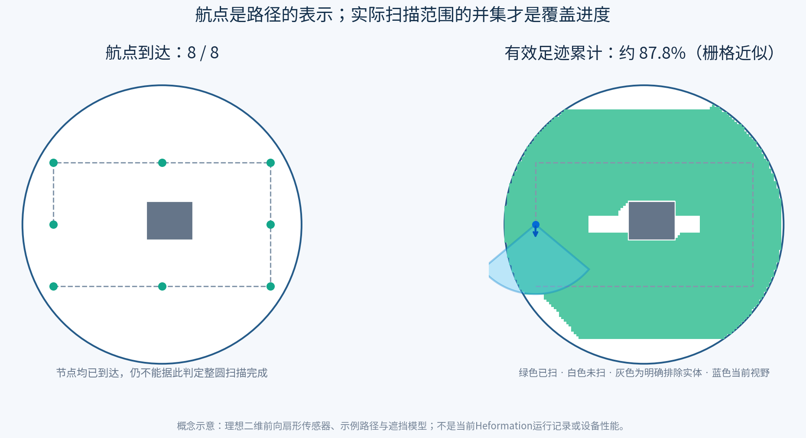

# 从“到达观测点”到“实际视野覆盖区域”：Heformation 调研与调整建议

日期：2026-09-28。代码核查基线：`main@b8b6421`。**本文件是研究与实施建议，尚未修改当前观测模型、Action接口或任务成功判据。** 检索优先2023–2026年的T-RO、IJRR、RA-L、ICRA、IROS、RSS，另保留与声呐实际漏扫直接相关的权威早期工作；不把本次检索宣称为所有论文的穷尽系统综述。

## 1. 结论与现有实现核查

用户提出的“航行器有探测视野，运动过程中把扫到的区域累计起来，直到完成选区扫描”是区域监测应有的执行语义。现有工程已贯通任务分工、跨介质运动、支援、结果接收和共同返航，但覆盖验收仍是**有限观测见证点的几何代理**。

“使用航点”本身正常：覆盖路径最后仍需要用航点、样条或路径段表示。问题是不能把“航点到达／点产品齐全”直接当成“整片面积已被扫描”。此前21/21结果的通过记录仍有效，但只证明当时声明的21点观测/交付及运动返回合同，不能追认整圆100%面积覆盖。



图为本轮生成的概念示意：同一路线8个航点均到达，理想二维方向性视野、量程和遮挡模型下仍只覆盖约87.8%的目标栅格；不是当前仿真测量，也不是装备性能。灰色实体在此示例中明确排除出任务目标，白色仍为未扫。

**用户后续澄清**：实际希望获取区域环境信息，障碍物被探测到的表面也是有效成果；不是把障碍一律挖成任务孔洞。上图仅用于说明航点到达不等于覆盖，不作为三维环境探测的任务图。障碍已探测表面、遮挡后未知部分及可通行空间应分别表达。这里的区域内扫描规划属于执行职责；下文§5.4已修正，当前不增加条带级任务分配器。

| 当前源码 | 实际行为 | 与目标差距 |
|---|---|---|
| [monitoring_request.py](../../integration/qn_aav_simulator/src/qn_aav_simulator/monitoring_request.py):81–158 | 圆区生成最多64个往复式见证点；间距取`min(1.25*footprint_radius,radius)`；等权；移除机体中心无法占据的点 | 没有目标面的裁切cell、实际面积分母或覆盖误差；可航行空间与待观察目标被混用 |
| [observation_coverage.py](../../integration/qn_aav_simulator/src/qn_aav_simulator/observation_coverage.py):271–280 | 水平半径、垂直带、SOLID视线遮挡 | 已有范围判定，但无实际姿态/传感器外参/FoV角，不能表现用户画的前向视野 |
| 同文件:353–405 | 实际位置/介质/时间有效性驱动连续驻留；达到要求后产生当前Goal内点产品 | 基础可保留，但累计对象为点；窗口受Goal的点ID集合限制 |
| [formation_action_server.py](../../integration/qn_aav_simulator/scripts/formation_action_server.py):1590–1600 | AIR只有在`HOLDING`且参考已采用时才计算观测 | 飞行途中的视野没有累计 |
| [executors.py](../../integration/mrta_python/executors.py):534–539 | 每个AIR见证点一个survey step，只声明本点ID，现模板每点4秒保持 | 邻域即使已扫也要再派点；覆盖与停靠绑定 |
| [platform_action.py](../../integration/qn_aav_simulator/src/qn_aav_simulator/platform_action.py):141–148；executors.py:612–642 | WATER每个真实模型步可采样；UUV整条WATER_PATH携区域全部点ID，仅整段末端保持 | **UUV不是逐点停车**，但仍检查全向圆形代理范围与点产品 |
| observation_coverage.py:231–252 | 分母为点权重之和；实收点且有效才计交付 | 当前显示100%是点权重比，不是平方米面积比 |
| [formation_mission_runner.py](../../integration/qn_aav_simulator/scripts/formation_mission_runner.py):816–900 | 目标区等待各动作终态、终结报告及报告中的正产品，再共同返航 | 负报告也属于完整信息；现策略首轮返岸后才补测，不能当作目标区残余覆盖已完成 |
| [mission_console.py](../../integration/qn_aav_simulator/scripts/mission_console.py)、[scene_publisher.py](../../integration/qn_aav_simulator/scripts/scene_publisher.py) | 静态圆、预计线、点球；进度按point ID统计 | 没有瞬时视野、累计扫过面、剩余/遮挡区域图 |

当前主请求没有强制编队。Swarm运动优化、任务分配和资源互斥都是已有基础，**它们本身不定义传感器是否看到了目标**。

## 2. 近期、有官方源码的优先研究对象

下表把“论文正式状态”“代码可获得”“在本工程可直接使用”分开。未在本项目编译运行这些框架，不声称已复现。

| 优先来源 | 论文 / 官方代码 | 与本任务直接相关的机制 | 不能原样继承 |
|---|---|---|---|
| **FC-Vision，RA-L 2026** | Feng, Xu, Shen；11(8):9907–9914；[出版记录/DOI](https://researchportal.hkust.edu.hk/en/publications/fc-vision-real-time-visibility-aware-replanning-for-occlusion-fre/)，[正文](https://arxiv.org/html/2602.13720v1)，[GitHub](https://github.com/FC-Family/FC-Vision) | 在线检查相机视野遮挡，修复视点并在位置/朝向连接段保持目标可见 | 已知目标结构、pitch/yaw云台、在线障碍图；保持原计划覆盖子集≠任意ROI完整覆盖。顶层非商业许可与部分文件头文字不一致；源码可读不等于可直接无条件复制 |
| **MDNUC，ICRA 2026 已接受** | Larrazabal, Yang, Goienetxea, Valls Miro；[作者稿](https://arxiv.org/abs/2605.13123)，[GitHub](https://github.com/MaiLa24/mdnuc) | 海床深度改变MBES足迹宽度，按深度分区并联动航线/扫描张角 | 已核到接收状态，正式IEEE DOI未核得；全部执行实验为VRX，真实港口指地形数据。ROS2/Gazebo依赖不直接接本项目；部分核心包许可未完整声明 |
| **SOAR，IROS 2024** | Zhang et al.；10975–10982；[出版记录](https://researchportal.hkust.edu.hk/en/publications/soar-simultaneous-exploration-and-photographing-with-heterogeneou-2/)，[正文](https://arxiv.org/html/2409.02738v1)，[GitHub](https://github.com/Robotics-STAR-Lab/SOAR) | 未覆盖表面生成视点，视点聚类后增量分配，多机同时探索/拍摄，并限制任务重排造成的反复折返 | 原场景未知，LiDAR探索者与RGB拍摄者异构；验证为MARSIM/Blender仿真，假设全局通信，不是空海潜海试。GPL-3.0、ROS Noetic/Melodic；当前已知地图无需新增探索者角色 |
| **FC-Planner，ICRA 2024** | Feng et al.；8686–8692；[正文](https://arxiv.org/html/2309.13882v2)，[项目](https://hkust-aerial-robotics.github.io/FC-Planner/)，[GitHub](https://github.com/HKUST-Aerial-Robotics/FC-Planner) | 5-DoF视点、FoV和射线遮挡、未覆盖目标补视点、连续位置/相机朝向轨迹 | 主要为先验点云结构检查；不能把规划覆盖标记当实际覆盖。GPL-3.0；Noetic/Melodic基础较接近当前工程 |
| **SEE，IJRR 2024** | Border & Gammell；43(10):1506–1532；[正文](https://arxiv.org/html/2207.13684v4)，[DOI](https://doi.org/10.1177/02783649241230098)，[GitHub](https://github.com/robotic-esp/see-public) | 新测量点云与传感器位姿→core/frontier/outlier→未充分观察边界→下一视点 | 适于未知表面重建；无frontier不是给定ROI100%证书。原主循环到视点后更新，并非天然连续扫面。MIT、ROS Noetic |
| **LS-MCPP，T-RO 2025** | Tang, Mao, Ma；41:3348–3367；[正文](https://arxiv.org/html/2411.01707v2)，[DOI](https://doi.org/10.1109/TRO.2025.3567476)，[GitHub](https://github.com/reso1/LS-MCPP) | 栅格覆盖划分、负载改进、转弯代价及多机路径冲突消解；有实体机器人验证 | 二维邻接栅格访问不自动等于朝向相关相机/声呐观测。GPL-3.0；可借覆盖任务表示与局部改进，不迁入另一套调度权威 |
| **Fields2Cover，RA-L 2023** | Mier, Valente, de Bruin；8(4):2166–2172；[正文](https://arxiv.org/abs/2210.07838)，[DOI](https://doi.org/10.1109/LRA.2023.3248439)，[GitHub](https://github.com/Fields2Cover/Fields2Cover) | 区域/孔洞→扫描条带→访问次序→可转弯路径，明确把扫描宽度与机体尺寸区分 | 原任务为农业地面车辆，工具扫宽不是前向视觉投影。当前库C++/Python，BSD-3-Clause；不必引入其ROS2任务服务 |
| **TMSTC*，RA-L 2023** | Lu, Zeng, Tang, Lam, Wen；8(8):5275–5282；[DOI](https://doi.org/10.1109/LRA.2023.3293319)，[GitHub](https://github.com/CourierLo/TMSTC-Star) | 在多机栅格覆盖中减少转弯并分配路径负担 | 不含本项目的方向性传感/海洋动力学。官方仓库提示Noetic存在问题，适合读算法，不能称即装即用；GPL-3.0 |
| **IRIS-U²，T-RO 2025** | Alpert, Solovey, Klein, Salzman；41:2406–2423；[正文](https://arxiv.org/pdf/2309.06113)，[DOI](https://doi.org/10.1109/TRO.2025.3548528)，[GitHub](https://github.com/CRL-Technion/IRIS-UU) | 明确区分命令路径与带执行误差的路径，评价观测/碰撞概率 | 本文为简化在milestones计观测；假定误差分布和可信执行模拟器。不是本轮低开销连续覆盖的直接替代，也不能忽略规划选择造成的统计偏差 |
| **Flow Matching Ergodic Coverage，RSS 2025** | Sun, Pinosky, Murphey；[会议论文](https://www.roboticsproceedings.org/rss21/p051.html)，[GitHub](https://github.com/MurpheyLab/lqr-flow-matching) | 让轨迹分布接近目标信息分布，支持复杂动力学的探索控制 | 分布匹配不等于有限时间把ROI每处扫到；仅在今后需求转为热点优先/持续信息采集时考虑。当前不引入JAX控制链 |

### 2.1 真正读到的源码位置：哪些可以借，哪些不能直接当“已扫”

以下为本轮核对的固定版本。只读源码，未安装其大型演示环境。

**FC-Planner `880c202ab3e4d472964bdc68405c45754b7ee5be`**：

- [perception_utils.cpp](https://github.com/HKUST-Aerial-Robotics/FC-Planner/blob/880c202ab3e4d472964bdc68405c45754b7ee5be/FC-Planner/src/active_perception/src/perception_utils.cpp#L29)：`setPose_PY`旋转视锥，`insideFOV`检查角度与最大距离，`getFOV_PY`生成绘图线段。这里仅pitch/yaw；遮挡不在此函数中。
- [viewpoint_manager.cpp](https://github.com/HKUST-Aerial-Robotics/FC-Planner/blob/880c202ab3e4d472964bdc68405c45754b7ee5be/FC-Planner/src/viewpoint_manager/src/viewpoint_manager.cpp#L533)：FoV后再raycast，并维护候选视点覆盖标志；这些标志不能直接接成实际覆盖进度。
- [hctraj.cpp](https://github.com/HKUST-Aerial-Robotics/FC-Planner/blob/880c202ab3e4d472964bdc68405c45754b7ee5be/FC-Planner/src/hierarchical_coverage_planner/src/hctraj.cpp#L75)：把途经点、相机pitch/yaw生成连续轨迹。适合借接口思想，运动执行仍用Swarm/qn。

**FC-Vision `c9ddf75d5dcfd997ad5a2487763618ea1131b9bc`**：

- [visibility_replan.h](https://github.com/FC-Family/FC-Vision/blob/c9ddf75d5dcfd997ad5a2487763618ea1131b9bc/src/visibility_replan/include/visibility_replan/visibility_replan.h#L167)：地图/输入路径/局部重规划/输出路径接口；可借其局部可见性修复职责。
- 重要边界：[traj_server.cpp](https://github.com/FC-Family/FC-Vision/blob/c9ddf75d5dcfd997ad5a2487763618ea1131b9bc/src/fc_vision_manager/src/traj_server.cpp#L603)将命令轨迹采样`pose_cmd`加入`exec_traj_waypts_`；[progressThread](https://github.com/FC-Family/FC-Vision/blob/c9ddf75d5dcfd997ad5a2487763618ea1131b9bc/src/visibility_replan/src/replan_fsm.cpp#L620)据该输入标记observed。不能根据变量名把这条链当成实际里程计累计。接本项目时必须明确改用actual pose/有效传感状态。
- 顶层非商业许可与部分源文件头文字不一致。这里记录源码可用性，不将其标为许可明确、可无条件复制的模块。

**SEE `b9f29b6daa4ed9322bcbdbef855a34ac048d3c11`**：

- [see_core.cpp](https://github.com/robotic-esp/see-public/blob/b9f29b6daa4ed9322bcbdbef855a34ac048d3c11/see_core/src/see_core.cpp#L69)：`UpdatePointCloud(new_cloud,sensor_view)`、可见性检查及下一视点选择。
- [see_main.cpp](https://github.com/robotic-esp/see-public/blob/b9f29b6daa4ed9322bcbdbef855a34ac048d3c11/see_core/nodes/see_main.cpp#L119)：先判断到视点，再读取/更新点云。因此可借核心测量反馈，不能原样当作边飞边扫的主循环。

**SOAR `6b8673f5158bcc428236e6d670abe8b0ba2c73bb`**：

- [heterogeneous_planner_manager.cpp](https://github.com/Robotics-STAR-Lab/SOAR/blob/6b8673f5158bcc428236e6d670abe8b0ba2c73bb/src/planner/heterogeneous_manager/src/heterogeneous_planner_manager.cpp#L2017)：`taskAssignment`、代价矩阵与一致性代价；可借“聚类减少调度对象、复用旧分配、只调整必要部分”的机制，不照搬整个遗传算法或新增调度服务。
- [coverage_manager.cpp](https://github.com/Robotics-STAR-Lab/SOAR/blob/6b8673f5158bcc428236e6d670abe8b0ba2c73bb/src/planner/heterogeneous_manager/src/coverage_manager.cpp#L1738)：`updateSeenCells`用位置、相机pitch/yaw及FoV/raycast标记可见单元。
- 重要边界：[heterogeneous_planner_fsm.cpp](https://github.com/Robotics-STAR-Lab/SOAR/blob/6b8673f5158bcc428236e6d670abe8b0ba2c73bb/src/planner/heterogeneous_manager/src/heterogeneous_planner_fsm.cpp#L684)的覆盖更新使用实际odom位置，但相机角度取参考轨迹；它不是全实际传感位姿。另有按到达距离删visited viewpoint的逻辑，不能把visited列表清空当作我们的实测面积覆盖完成。
- 原文执行成本使用路径长度、视点簇内部代价估计与分配一致性项，不是逐候选运行完整机器人动力学。我们的跨介质、共享支援、返航仍由原Plan处理；已接受动作的硬约束不能被软一致性奖励替代。

**MDNUC `f3683dd5ac0529d6127152f9550ad74989bb7a28`，分支`ICRA2026`**：

- [mdnuc.cpp](https://github.com/MaiLa24/mdnuc/blob/ICRA2026/mdnuc_ros2/mdnuc_ros2/src/mdnuc.cpp)和[mesh_utils.py](https://github.com/MaiLa24/mdnuc/blob/ICRA2026/utils/mesh_utils.py)：深度区、扫描网格及路线生成。
- [pointcloud_saver.py](https://github.com/MaiLa24/mdnuc/blob/ICRA2026/wamv_wayfinding/wamv_wayfinding/pointcloud_saver.py)：坐标变换后累计点云并统计格点命中。
- [轨迹跟随器](https://github.com/MaiLa24/mdnuc/blob/ICRA2026/plugin_trajectory_follower/src/MyTrajectoryFollowerPlugin.cc)：最后航点触发保存，**不是残余覆盖为空才结束**。用LiDAR过滤模拟MBES，不能称真实声呐质量。核心包许可声明未完整，不能把所有包都当Apache 2.0。

## 3. 海洋任务的直接实证：近期与权威工作配合使用

新论文解决的方法不一定涵盖真实海试，较早研究也不等于其传感模型已经过时。以下用于补上“实际如何扫描、怎么发现漏扫”的证据，而不是为了堆引用。

| 文献与阅读范围 | 有依据的机制 | 结果/边界 |
|---|---|---|
| **Cecchi et al., JFR 2026**，*Redefining Optimal Coverage Path Planning for FLS-Equipped AUVs With Deep Reinforcement Learning*；[全文/DOI 10.1002/rob.70209](https://onlinelibrary.wiley.com/doi/10.1002/rob.70209)；已读足迹公式、实验 | FLS环扇投影随位姿变化，覆盖栅格进入策略；有水下真实执行 | 局部平海床、恒航高、pitch≈0；目标含90%–98%阈值。成功率100%不等于面积100%；本项目无需先引入RL |
| **Yordanova & Gips, RA-L 2020**，*Coverage Path Planning With Track Spacing Adaptation for Autonomous Underwater Vehicles*；[接受稿](https://arxiv.org/pdf/2006.12896)，[DOI](https://doi.org/10.1109/LRA.2020.3003886)；已读传感模型和三次海试 | 侧扫双条带/nadir gap/可用量程反馈，在线调整成对航线间距 | 一个实验漏扫4.40%→0.18%，增加一条航线及约14%路程；不是零漏扫，也没有免费覆盖增益 |
| **Zacchini, Franchi, Ridolfi, JFR 2022**，*Sensor-driven autonomous underwater inspections: A receding-horizon RRT-based view planning solution for AUVs*；[全文/DOI 10.1002/rob.22061](https://onlinelibrary.wiley.com/doi/10.1002/rob.22061)；已读模型/算法/海试 | FLS更新概率环境图，按信息/可见体素生成下一视点，再局部重规划 | 海试比较80%/90%覆盖；可能比专家lawnmower路线更长，优势是适应未知环境，不是全面优于有先验条带 |
| **Vidal et al., JFR 2020**，*Multisensor online 3D view planning for autonomous underwater exploration*；[DOI](https://doi.org/10.1002/rob.21951)；仅核出版社/机构摘要 | 将几何占据与光学已观察状态分开维护，声呐发现不代表相机已拍到 | 有GIRONA 500现场实验；详细完成条件需后续读全文，不能仅据摘要复制 |
| **Paull et al., IROS 2012 / T-Mech 2013扩展**，*Sensor driven online coverage planning for autonomous underwater vehicles*；[作者全文](https://people.csail.mit.edu/lpaull/publications/Paull_IROS_2012a.pdf)，[IROS DOI](https://doi.org/10.1109/IROS.2012.6385838)；已读模型/算法/实验 | 运动中更新声呐地理覆盖/置信图，用短期收益和远处未扫信息选航向 | 有硬件在环和IVER2水中试验；检测概率依赖载荷/目标/海床，不能直接当我们的参数 |
| **Galceran et al., JFR 2015**，水下三维结构覆盖与实时重规划；[DOI 10.1002/rob.21554](https://doi.org/10.1002/rob.21554)；核摘要和公开正文片段，全文下载未成功 | 平缓区扫线、陡坡等高轮廓和实时距离反馈 | 有防波堤/水下巨石海试；“3D”指三维空间中的二维表面，不是全水体体积扫描 |
| **Galceran & Carreras, IROS 2012**，*Efficient seabed coverage path planning for ASVs and AUVs*；[机构记录](https://recerca.udg.edu/es/publications/efficient-seabed-coverage-path-planning-for-asvs-and-auvs/)，[DOI](https://doi.org/10.1109/IROS.2012.6385553)；仅核正式摘要 | 深度和坡度影响足迹/航线间隔 | 真实测深数据上的仿真，不是实际海试 |
| **Wilson & Williams, JFR 2018**，*Adaptive path planning for depth-constrained bathymetric mapping with an autonomous surface vessel*；[作者稿](https://arxiv.org/pdf/1603.06324)，[DOI](https://doi.org/10.1002/rob.21718)；已读模型和实测 | 在线水深模型、安全水深边界、覆盖路线，真实ASV执行 | 单波束采样+GP插值；插值地图不等于每处直接扫描，模型标准差不是独立真值误差 |
| **Shkurti et al., IROS 2012**，*Multi-domain monitoring of marine environments using a heterogeneous robot team*；[作者全文](https://cim.mcgill.ca/~mrl/pubs/florian/iros2012.pdf)，[DOI](https://doi.org/10.1109/IROS.2012.6385685)；已读正文 | 空中宏观观察、专家指定兴趣区、ASV支持、AUV近距采集 | 海上多域协同实证；不是自动完整覆盖算法，不证明三类必须同时扫同一层 |

本轮未核到这些海试论文逐一对应的官方算法仓库，应标“未核到”，不能说“没有代码”。

## 4. 不同载荷不能共用一个全向圆

- **用户画的前向扇形**：适合作为二维方向性传感器抽象，至少有近/远距离、水平张角及实际朝向。转弯后扇形必须随传感器转动，背后区域不会自动算已扫。
- **俯视相机**：完整视锥与水面/地面相交，近似水平正俯视时为矩形，倾斜时通常为四边形；要考虑实际高度、姿态、安装外参、遮挡。机身航向不等于云台朝向。
- **前视声呐FLS**：可能是带近界/远界的环扇投影，取决于波束、俯角、航高和目标面，不能把扇形图标当成完整三维模型。
- **侧扫声呐**：左右条带，中间可能有盲带。航迹正下方“经过了”不代表“看到了”。
- **多波束测深**：足迹随航高和海床坡度变化。MDNUC的核心正是水面均匀路径不保证海床均匀覆盖。

模型选择来自载荷/任务模板。三台AAV同型号就共用同一套设备与方法参数，按AIR/WATER模式使用对应模型；不是给不同编号临时设不同能力。首版没有标定数据时，明确采用**声明的传感几何代理**，不引入不必要的渲染、目标识别或水声传播系统。

## 5. 本项目建议采用的最小覆盖定义

以下是综合文献和需求的工程建模建议，不是对已实现能力的描述。

### 5.1 目标域和运动域分开

用户圆区只是水平业务边界。分别定义水面/空中观察目标层`Ω_air`、指定深度层或海床目标`Ω_water`，以及真正需要采样的点集合`P_sample`。

- 空中拍到海面，不能抵消海底漏扫；不同成果类型各有覆盖分母。
- 机器人不能进入的空间`W_i`与需要观察的目标`Ω`不同。禁航区仍可能允许从外部观测；实体内部通常不属于海床面，但岩石表面若是检查对象就必须保留。
- 任务确定后固定分母，不能因某格不可达或被遮挡，就删掉它来提高完成率。真正排除的非任务孔洞明确展示；必做但不可观测区域保留为未完成/失败。
- 当前UUV的运动深度`z=-2`不是自动等于“被观测海床面”。若业务是海床监测，目标面应取场景海床/地形，传感射线投影到它；水质点采样则是另一类任务。

### 5.2 实际传感器视野

世界到传感器的位姿来自实际运动状态与设备安装/云台状态：

\[
T^{actual}_{WS}(t)=T^{actual}_{WB}(t)T_{BS}(t).
\]

令`F_i(t)`是该位姿下满足量程、视角、目标面相交、无遮挡、合法模式、载荷启用和有效时间戳的目标集合。

对于**只要求有效看见一次**的声明任务：

\[
C_{obs}^{\ell}(t)=\Omega_{\ell}\cap\bigcup_{i\in\mathcal R_{\ell}}\bigcup_{\tau\le t}F_i^{valid}(\tau),\qquad
\eta_{obs}^{\ell}(t)=\frac{\mu(C_{obs}^{\ell}(t))}{\mu(\Omega_{\ell})}.
\]

`μ`是目标面的面积测度，三维水体任务才使用体积。重复扫描按并集去重。若载荷/业务要求驻留、多帧或测量质量，则在加入`C_obs`前增加相应证据条件，不能用一瞬间看见替代；也不应给所有区域任意增加4秒停留。

`C_plan`来自预计路径，仅供选方案；`C_obs`来自实际有效状态/测量；`C_recv`来自母船确实收到的结果，必须满足：

\[
C_{recv}^{\ell}\subseteq C_{obs}^{\ell}\subseteq \Omega_{\ell}.
\]

不引入新的消息协议栈。沿用任务级交付和身份/去重机制，传送必要的覆盖增量或区域终结报告即可。

### 5.3 实现用固定分辨率cell，完成语义仍是面积

用`A_j = cell_j∩Ω`、`a_j=μ(A_j)`记录目标单元，边界格按裁切后的面积计权。覆盖状态跨同一请求的运动段保留，不能每个Goal重置。

- 可采用对整个目标cell保守的几何覆盖检查；若仅检查中心，要明确它仍是有限采样近似，并报告分辨率/边界误差。
- 采样足迹之间的区域不能随意补涂。移动中的传感器按声明采样频率取有效样本；缺帧、时间跳跃、参考失效时相应部分保持未知。连续时间保证需另外建立运动/采样界。
- “未扫”是尚未有证据；“漏扫”是已执行扫描后仍应补齐的缺口；“不可达/遮挡”是原因，不自动缩小任务分母。
- 同产品同质量层的不同机器人可合并覆盖；不同层或不同成果不能相互抵消。

### 5.4 路线、分工与补扫闭环

保留现有联合求解。**上层分配区域业务和角色，执行侧决定区域内怎么扫描。** 前述“少量条带联合分配”把两项职责说得过近；本次收敛为“区域任务联合分工＋执行侧在线扫描”。对当前每个目标层已有主要执行者的模板，不新增条带级分配、调度器或Action服务。流程为：

```text
用户目标区域 + 平台状态 + 声明载荷
  → 联合选择业务角色、成员、转换/支援安排及必要等待
  → 一份Plan交给原执行链
  → 区域扫描执行：传感更新 → 选择下一安全观察段 → 原生运动执行
                      ↑                 ↓
                      └─实际观测/运动反馈─┘
  → 当原分工无法继续或需要额外支援时，向上层反馈以修复未承诺安排
  → 本轮残余覆盖不满足要求时，在同请求内安排允许的一轮补扫
  → 必要覆盖结果实收、作业终态成立后共同返航
```

扫描条带是开阔/先验已知目标面的初始运动方案，可在出发前准备，但在执行中按观测和障碍更新。复杂三维表面可改用下一最佳视点/短段；不要求所有场景硬套平面往复条带。机器生成的航点或样条控制点仍可作为运动接口，不再把人工固定业务点或必须停靠每点作为区域监测的定义。普通视点/短段更新不是新增业务补测轮次；只有首轮结束报告触发的新补测作业才计入一次补测政策。

只有多个同成果类型成员共同承担同一层大区域时，才需要划分子区/扫描工作量，并可在已有Plan中表达。SOAR和LS-MCPP在这类情形有参考意义，不意味着当前模板要多一次全局分配。区域局部绕行和补视点由原执行端处理；成员失效、不可继续覆盖或支援需求显著变化时才修改上层安排。

条带间距应由有效扫描宽度及声明重叠/误差余量给出，如`d≤w_valid(1-o)`；这里是适用条件下的几何关系，不给所有载荷硬套同一数字。传感足迹不对称或有盲带时，必须按完整足迹求并集/检查缺口，不能只使用一个横向宽度。

上层快速评价继续只用能力/状态/占用、新增必要覆盖、几何可达性、路线长度、必要转弯和支援条件；时间为估计或预算指标，不逐候选完整积分动力学。精确运动与途中反馈仍交给Swarm/qn/PVS。对当前五平台小规模，先取得覆盖要求完整的合格候选，不把LS-MCPP的百机搜索、RL或复杂不确定性证书作为门槛。

具体取舍：**FC-Planner提供视野/遮挡和缺口视点的依据；FC-Vision提供运动绕障后重验可见性的依据；MDNUC及水下实证提供扫宽/航高/盲区随状态变化的依据。** 已知平缓目标面先用简单条带，局部遮挡再加必要视点。SEE适合未知表面；SOAR和LS-MCPP适合需要多成员同层任务分区的情况，不作为当前模板新增分配层的理由。

### 5.5 环境探测建图、观测完成与避障的区别

用户进一步描述的任务可称为**面向区域环境探测的自主探索与覆盖式感知**：无先验时是autonomous exploration and mapping；已知结构但需取得测量时是coverage inspection / view planning；根据未观测信息主动调整运动是active perception。名称依业务范围而定，不以一个术语假定已经实现SLAM或三维重建。

- 对有效深度/测距观测，沿射线到首个命中前可获得自由空间证据，首命中表面获得占据信息，后方仍未知。声呐需按其波束和回波模型处理，不能机械套用单一精确激光射线。[OctoMap官方模型](https://octomap.github.io/)、[作者全文](https://www.arminhornung.de/Research/pub/hornung13auro.pdf)提供free/occupied/unknown区分，这是基础表示依据，不是要求迁入新框架。
- 发现岩石前表面是有效探测；不能由此宣称岩石背面、后方海床或内部全部被测到。避障使用已知占据及必要余量，未知不默认等于可通行；覆盖规划从安全位置观察未知/未充分观测部分。
- 占据状态和任务观测状态是不同属性，**一个已知障碍表面可以已观测，也可以仍缺少所需成像质量**。SOAR区分环境发现与拍摄覆盖；[Vidal等JFR2020](https://onlinelibrary.wiley.com/doi/10.1002/rob.21951)直接联合水下占据探索与光学覆盖；SEE依据实际点云密度判断表面是否充分观测。
- 现有已知场景可继续作为安全先验，但先验地图存在不代表本次传感器已经采到数据。若要演示未知场景发现，仿真真值只能用于生成传感器观测/独立评估，执行地图应从这些观测更新；仅显示全部场景点云不能称为在线探测建图。仿真可用已知实际位姿，定位/SLAM研发不因此成为本轮必要内容。
- §5.1–5.3的固定面积分母适用于已声明目标面。未知三维环境的真实总表面积事先不知，不能用当前已发现面积作分母便宣布整个ROI100%；需声明空间边界、观察要求、残余frontier及不可观测部分。轨迹安全、几何发现、载荷覆盖和数据接收仍分别判断，但无需各建一个服务。

### 5.6 最新收敛：区域覆盖建图与局部重规划（用户后续要求）

本次业务可直接定义为“到指定区域进行覆盖建图”。无需扩展到目标识别或水质分析。未知环境假设下，不允许任务端在出发前读完整障碍真值并锁定全程路线；但区域目标、根据已探测地图更新的方向引导及已探索路径记忆仍应保留。只做临近障碍时的无记忆绕行，既不能保证系统性覆盖，也可能反复进入死胡同。

#### 新核实的直接来源

| 来源与正式状态 | 已核实方法 | 本工程采用边界 |
|---|---|---|
| **FALCON，T-RO 41:1365–1385，卷年2025、在线2024-12-25**；[出版记录](https://researchportal.hkust.edu.hk/en/publications/falcon-fast-autonomous-aerial-exploration-using-coverage-path-gui/)、[作者正文](https://arxiv.org/html/2407.00577v2)、[官方源码](https://github.com/HKUST-Aerial-Robotics/FALCON) | §III–V：新传感测量更新体素图及连通关系，更新整体覆盖引导、选择局部观察目标；§V-C实际导航在已知自由空间搜索，生成可执行轨迹 | 借当前地图驱动观察目标和保持探索记忆；不迁它的完整区域分解/TSP/轨迹框架。未知环境仍可有在线全局引导 |
| **SUPER，Science Robotics 2025，10(98):eado6187**；[DOI](https://doi.org/10.1126/scirobotics.ado6187)、[作者正文](https://github.com/hku-mars/SUPER/blob/master/misc/scirobotics.ado6187.pdf)、[官方源码](https://github.com/hku-mars/SUPER) | 维护探索轨迹及已知自由空间内的安全备份；应用实验中全局探索器在线产生航点，SUPER局部避障执行 | 借提前感知、短段重规划与安全退路的原则。四旋翼备份轨迹的保证不能直接赋给qn WATER或Otter，不迁入第二个控制器 |
| **RACER，T-RO 2023，39(3):1816–1835**；[正式记录](https://ieeexplore.ieee.org/document/10038280)、[官方源码](https://github.com/Robotics-STAR-Lab/RACER) | 多机在线探索分工、覆盖引导、局部视点和轨迹分层联动 | 支持未知环境中的多机参考；本轮不替换当前集中任务权威、不新增其分布式分配 |
| **FUEL，RA-L 2021，6(2):779–786**；[作者稿](https://arxiv.org/abs/2010.11561)、[官方源码](https://github.com/HKUST-Aerial-Robotics/FUEL) | 增量frontier信息、覆盖引导、局部视点、轨迹生成 | 与当前Swarm代码族接近的权威早期来源，不因它有完整框架就整库迁入 |

FALCON的§III–V及SUPER的双轨迹/应用段已读；本轮未安装或运行这些上游框架。安全退出/制动需要本平台实际模型支持，不能凭“局部规划”三个字保证安全。

#### 本地代码定位：当前并非所有平台都没有局部规划

以下表格是实施前 `b8b6421` 的代码定位快照，路径相对仓库根；后续已在原文件中接入 ONLINE_MAPPING，最新实施结果见 WORKLOG 和当前状态，不用旧行号表推断当前运行能力。

| 文件与行号 | 当前事实 | 直接调整 |
|---|---|---|
| `monitoring_request.py:138–205` | 依据全部`StaticSceneGeometry`删除扫描见证点、选择入水点和USV支援点；UUV最后扫点决定会合 | 请求仅保留区域、成果要求及明确先验；不使用尚未发现的障碍筛选。候选位置按执行时已获得信息确认，不能预承诺未经观察的入口可用 |
| `formation_mission_runner.py:2163–2167` | 从`/scene`读取全场geometry给任务provider | 算法端仅使用声明先验/实际收到的地图信息；全场geometry仅供传感仿真、真值显示及独立审计 |
| `integration/mrta_python/executors.py:422–429,534–539,570–642,701–709` | 任务层用全图调用`plan_static_path`，提前展开AIR逐点Action及WATER/USV工作、返回整路线 | 任务层保留区域动作/角色/支援；路线和观察目标由执行端滚动产生，粗成本只作估计 |
| `integration/mrta_python/executors.py:1691–1754` | 完整计划校核仍要求全静态路径和`geometry_checked` | 保留真实成员互斥、承诺及协作条件；改为检查当前可执行片段，未知远段不得伪称完整物理可行。不能只是删路径调用，继续要求原全图证据 |
| `platform_execution.py:13–61` | 使用所有场景盒障的膨胀角点可见图+Dijkstra | 算法可作为已观测几何下的连接手段；不能在只看到物体一角时直接载入完整真实盒体，更不能用它代替三维感知地图 |
| `scene_publisher.py:599–639` | 从所有SOLID对象生成`/scene/global_cloud` | 保留为仿真世界真值；它不是已获取的任务建图成果 |
| `integration/swarm_qn_bridge/simulator.xml:138–155`；`upstream/Swarm-Formation/src/uav_simulator/local_sensing/src/pointcloud_render_node.cpp:118–138` | 实际AIR用CPU renderer，实际odom+5m半径+方向筛选，没有首回波遮挡；不是全云直接送Swarm | 补传感器可见性/首命中输出，未知区域不能穿过前方物体被提前揭示；不以缩短range代替该修复 |
| `upstream/Swarm-Formation/src/planner/plan_env/src/grid_map.cpp:803–913` | 当前cloudCallback主要reset/写膨胀障碍，未raycast维护free/unknown；深度路径另有raycastProcess但当前未用 | 接通可区分自由/占据/未知的观测更新；只用“未膨胀占据”不能证明该处已观察为自由 |
| `upstream/Swarm-Formation/src/planner/plan_manage/src/planner_manager.cpp:318–366,138–178`；`ego_replan_fsm.cpp:282–375` | GlobalTraj仅min-jerk目标引导、不读地图；局部目标截取后在线查碰撞/重规划 | **保留该引导和局部优化**。实际感知5m、原horizon7.5m不是安全保证；短段采纳需依据已知自由范围及本机制动/延迟条件 |
| `formation_action_server.py:583–599,1590–1600,1862–1868` | 局部云只用于就绪检查；HOLDING位置采样产出点产品 | 原区域Action消费有效传感测量、实际姿态并累计建图；选择下个视点，普通更新不另建Goal服务 |
| `platform_action.py:214–269,398–450`；`scripts/pvs_node.py:195,360` | 收到整条Path后持续跟随，WATER参考yaw固定0，没有感知后改线循环 | 原Action内按实际状态更新未执行短段及需要的朝向；qn/Otter控制保留，不能重置速度/trim或依赖瞬停 |
| `scripts/mission_console.py:83–89,112` | UI显示所有场景障碍，还把岩石/禁区称为覆盖孔洞 | 选区图只显示明确先验及已收到探测，成果图显示实际获取表面/未知；真值可作为明确标识的独立参考，不当作完成进度 |

表中未给全路径的`monitoring_request.py/platform_execution.py/platform_action.py`位于`integration/qn_aav_simulator/src/qn_aav_simulator/`；`formation_mission_runner.py/formation_action_server.py/scene_publisher.py`位于`integration/qn_aav_simulator/scripts/`。

实施先后见根`plan.md`。最先解决真实局部观测与地图更新，再接原Action的区域扫描循环，随后撤掉任务端全真值路线依赖并同步完成判据。未知环境下初始方案是当前信息下的任务安排，不宣称已证明所有未来路线可行；任务期内常规绕障留在执行侧，无法继续、换成员或支援变化才上报同一任务程序。

## 6. 原代码内的实施顺序与最小验收

| 原位置 | 直接调整 | 能改变正确性结论的一项验收 |
|---|---|---|
| request / SurveyRegion | 把固定目标cell与运动航点分开，分层确定面积分母、传感模板和明确排除域 | 改航点密度不能偷偷改变同一业务区域的分母 |
| `_visible` / LocalObservationWindow | 输入实际姿态和传感安装关系，FoV+量程+LOS；跨运动段保留同一请求覆盖；移动时有效扫描 | 同位置转动视野，只覆盖真正扫过方向；遮挡后方不着色；重复扫描不重复加面积 |
| 原AIR Action / Swarm接口 | 去掉“业务观测必须HOLDING”的门，但保留参考采用、安全与采样有效性；一段扫测包含多个路径控制点 | 单纯放开采样不等于连续飞行：当前Formation.action只有一个目标，必须实际接通原Swarm多航点/连续段入口才能取消逐点停顿 |
| qn WATER Action | 继续沿整段运动采样，换为相应声呐/目标面的覆盖模型 | 水下绕行仍会造成覆盖缺口，不能用完成轨迹代替面积条件 |
| 原Plan / worker / CoverageResult | 覆盖、交付、物理终态独立；明确残余区域在目标区触发的一轮补扫，再统一撤收 | 所有路径执行完但残余面积未达要求时，不得PASS或先返岸冒充已扫完整 |
| Qt / RViz | 用同一传感几何画瞬时轮廓、已扫、已实收、未扫和遮挡原因；计划只用淡虚线 | UI颜色/面积与任务权威一致，不把预计路线涂成已扫描 |

业务层的区域任务不应每个cell或每条扫描线一个分配任务；cell是观测记账单元，条带/视点是区域动作内的运动参考。沿用请求、Plan、原worker和Action，禁止再套覆盖管理服务、传感器注册中心或通用工作流。

推荐第一项端到端验收：同一圆区含一处可解释遮挡；两AAV/USV/UUV按原角色并行工作；有效视野随运动转动并累计面积；故意留下一个可补扫缺口，系统在目标区安排一次补扫；覆盖与必要接收完成后共同返航。目标是可视化的业务闭环，不是单机测试数量。

## 7. 其他权威来源与不选用的方向

- **Jing, Deng, Wu, Shimada，IROS 2020**，[路径片段覆盖全文](https://arxiv.org/pdf/2007.13065)：覆盖在边上累积，途经点连接路径，不要求所有节点停靠；已知静态网格/离线评价，实执行不确定性未解决。特别适合解释“保留航点，但换覆盖判据”。
- **Bähnemann et al.，FSR 2019 / 论文集2021**，[全文](https://arxiv.org/pdf/1907.09224)、[Noetic官方代码](https://github.com/ethz-asl/polygon_coverage_planning)：多边形孔洞、按扫宽生成条带、GTSP次序、可见图转场；有M600 Pro实飞，但采用rest-to-rest时间模型。不是连续扫面的唯一设计。
- **Bircher et al.，ICRA 2015**，[作者算法说明](https://www.kostasalexis.com/structural-inspection-path-planning.html)、[官方SIP](https://github.com/ethz-asl/StructuralInspectionPlanner)：FoV/入射角/视点与连接路线联合调整；旧Indigo依赖，本轮未成功取全文，不作为近期移植首选。
- **Cortés, Martínez, Karatas, Bullo，T-RA 2004**，[作者稿](https://motion.me.ucsb.edu/pdf/2002j-cmkb.pdf)：传感网络的覆盖配置/分布优化。不能把Voronoi部署平衡自动当成有限时间累计扫完整ROI。
- **Smith, Schwager, Rus，T-RO 2012**，[作者全文](https://msl.stanford.edu/papers/smith_persistent_2012.pdf)：已知闭合路径上调速控制环境不确定性增长；属于持续监测，任务没有一次性的“扫完”，不替换当前扫完返航目标。
- **Galceran & Carreras，RAS 2013综述**，[作者机构记录](https://recerca.udg.edu/en/publications/a-survey-on-coverage-path-planning-for-robotics/)：用于分类和追溯基础方法，不将其当作近期前沿成果。
- **REACT，作者页称ICRA 2026已接受**，[项目](https://abdelhakim96.github.io/REACT/)：系缆避缠绕的水下覆盖；本轮未核到算法源码，GitHub Pages不等于开源实现。当前没有系缆需求，排除整套引入。
- **ODIN/MuJoCo，Ocean Engineering 2025**，[论文](https://doi.org/10.1016/j.oceaneng.2025.122902)、[代码](https://github.com/duccuongvu/AUV-ODIN-mujoco)：重点为最终传感器节点部署覆盖，不能因为标题包含coverage就拿来解决运动中的累计扫描。

## 8. 检索与证据边界

检索词覆盖camera FoV/visibility-aware scanning、sensor footprint/swept area、coverage path planning、sonar/nadir gap、online coverage map、multi-robot coverage/deconfliction及persistent/ergodic coverage。主要依据作者论文、出版社/大学正式记录、会议论文集和官方GitHub；对论文方法线沿引文回溯。本轮同时尝试学术连接器：Elicit无API访问权限，未获得结果；OpenAlex补充检索噪声较多，不把无关命中计入依据。

正文及模型/源码深入核对集中在FC-Planner、FC-Vision、SOAR、SEE、IRIS-U²、MDNUC、Jing 2020、Paull 2012、Yordanova 2020、Zacchini 2022、Cecchi 2026及LS-MCPP；仅核摘要/局部片段的论文已在表中标出。最新版本日期与GitHub许可可能变化，源码位置以本次记录的commit为准。

当前没有任何一个核查框架可以不加适配便完整解决“同型跨介质AAV＋UUV＋USV、任务级共享支援、真实姿态覆盖、残余补扫与共同返航”。推荐吸收其有依据的几何和执行机制，在现有工程直接补齐，而不是因新论文或Github名称再迁移整个系统。
