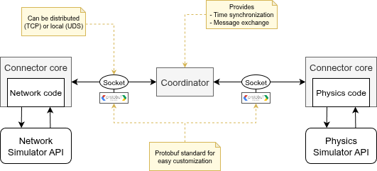

# Summary

**DANCERS** (Distributed, Autonomous, Networked and CooperativE Robots Simulator) is a tool for the simulation of Networked Multi-Robot Systems (NMRS), i.e. groups of robots that regularly exchange information over a computer network, often using wireless technologies such as Wi-Fi or 5G. DANCERS enables to study jointly the robotics aspects (physics, actuators, sensors, etc.) and the networking aspects (protocols, radio wave propagation, routing, etc.) of these cyber-physical systems. To achieve this, DANCERS provides a synchronization framework that interconnects two existing simulators: one for the robotics side, another for the networking side. Instead of developing a new simulator from scratch, this **co-simulation** approach benefits from years of development effort already invested in each specialised simulator. DANCERS can interconnect **any** pair of robotic and network simulators. At the time of writing, the connectors for three simulators are available: [Gazebo](https://gazebosim.org/home) (a well-known all-purpose robotic simulator), Mini-Dancers (a multi-drone simulator based on [CTU's multi-rotor models](https://github.com/ctu-mrs/mrs_uav_system)), and [ns-3](https://www.nsnam.org/) (the state-of-the-art network simulator for research). For example, \autoref{fig:gazebo_minidancers_screenshots} shows two different robotics simulators: Gazebo and Mini-Dancers. DANCERS is built as a ROS2 project to be easily interfaced with other robotic libraries and the simulation's visualization is handled by the chosen robotic simulator. DANCERS supports any type of robots and networks, as long as they are supported by the underlying simulators, but the provided examples concern Unmanned Aerial Vehicles (UAVs) and Wi-Fi. 

{ width=80% }

DANCERS is intended for researchers interested in NMRS, and in particular to people working on Mobile Ad-hoc Networks (MANETs), cooperative robotics and swarms of robots.

The software has been evaluated in terms of computing efficiency (co-simulation overhead, the cost of synchronization) and correctness (no corruption of the simulation results) [@balaguer_dancers_2025].
Documentation and tutorials are available, including Docker containers for cross-platform availability and easy installation.

# Statement of Need
Most multi-robot systems (MRS) rely on wireless communication to collaborate, to navigate together and to share environment data. Sometimes, the task itself is related to communication, such as providing connectivity to ground users, or transmitting information between two positions. Studying these systems in simulation allows for fast, inexpensive and reproducible experiments that would otherwise be extremely difficult to conduct in the real world. Both the robotics and the wireless networks communities have used simulation for decades, and their respective simulators are now well established, extensive, refined, and benefit from large and active developer communities. However, these two types of simulators fail to provide realistic simulations of networked multi-robot systems: robotic simulators tend to ignore networking issues, while network simulators have unrealistic physics simulation and no robot models. Still, it seems necessary to use existing simulators to benefit from the years of development already invested and to have the support of their developers communities. These observations tend to favor **co-simulation** - the interconnection of multiple simulators to increase the realism of a simulation - as the main technique to create a joint robotic and network simulator.

A simulator with high fidelity in both the robotics side and the network side can be useful in many use-cases. In research and early design of communication techniques and protocols, it provides a rapid and inexpensive experimental tailored to the mobility of robots. It also enables the development of learning-based methods, that require a fast and accurate simulation. It can also help with the validation of multi-robot control techniques, that often rely on communication but rarely consider the uncertainties of wireless networks in their evaluation. A realistic robotic and network simulator also helps with the sim-to-real transfer, with the ability to run the same software in simulation and in real-life (Software-in-the-Loop, SITL).

# State of the Field
Other works tackled the task of creating a co-simulator for NMRS, and a recent and complete list of existing co-simulation platforms can be found in the Table I. of [@acharya_cornet_2023]. However, these initiatives rapidly become obsolete because of the rapid evolution of the surrounding software. As robotic and network simulators fall out of maintenance (Player/Stage, ns-2, WINTERSim, etc.), the co-simulators built around them also become obsolete. The same issue arise with the evolution of the development software around these tools, such as the transition from ROS1 to ROS2. Some key co-simulation features, such as bidirectional time synchronisation, are also missing in some existing co-simulators. The lack of documentation, and the fact that developers no longer work on these topics make contributing to existing software even more challenging.

DANCERS is inspired from past initiatives: its core architecture and the use of the Protobuf protocol was inspired from ROS-NetSim [@calvo-fullana_ros-netsim_2021], and the use of Sockets appeared in RoboNetSim [@kudelski_robonetsim_2013]. In addition of being adaptable to modern software frameworks (ROS2, Gazebo, ns-3, etc.), DANCERS stands out by its strong fondamental co-simulation properties, such as bidirectional synchronization, time management (slower/faster than real-time) and great adaptability (support for any simulator with minimal overhead).

# Software Design

{ width=90% }

One of the key design choice of DANCERS is the ability to interconnect **any** physics simulator with **any** network simulator. This led to having three separated modules, as shown in \autoref{fig:dancers_architecture}: two *Connectors* handle the interface with specific simulators, and the *Coordinator* provides time synchronisation and information exchange between the parts. This architecture makes it easy to connect a new simulator to DANCERS, only a short C++ *Connector* file has to be created. To reduce even more the implementation effort, the required features for the interconnection with DANCERS are bundled in a "Connector Core" class that has only two pure virtual methods: `ReadConfigFile` and `StepSimulation`. Creating a connector for a new simulator thus only requires creating a class that inherits from the "Connector Core" and implementing these two methods.

Synchronisation between the two simulators is handled by the Coordinator for both time and information (for example, robots' positions). The two sides of the simulation run in parallel, and are synchronised by the Coordinator at each *iteration* ($\Delta$ microseconds). A "synchronisation" implies two procedures: the fastest simulator waits for the slowest one; information is exchanged between the simulators. It is possible to further divide the time between two *iterations* by defining a *step-size* ($\delta$ microseconds) satisfying the relation $\Delta / \delta = N, N \in \mathbb{N}$, which is occasionaly useful, for example to have more frequent updates regarding the state of the network during SITL simulations. 

Another central design choice of DANCERS is the use of sockets for inter-process communication (IPC). A discussion comparing different IPC techniques (*sockets*, *message queues*, *shared memory* and *message passing*) can be found in [@kudelski_robonetsim_2013] and we share the authors' conclusions that the best technology for a robotic and network co-simulator are sockets, because of their flexibility:

- Works locally and remotely, enabling distributed simulation,
- Platform independent, enabling simulators to work under different Operating Systems,
- Offers a good balance between efficiency and ease of use.

The messages exchanged are serialized with the Protobuf standard, and then compressed with the zip algorithm. The content of the messages must be decided by the user, depending on the research needs, with the exception of robots' position, that *must* be included in the message flowing from the robotics simulator to the network simulator (otherwise, the network simulator would output invalid communication results). This *payload* exchanged between the two simulators fixes the level of interdependence (which enables studies of network-aware control algorithms, for example), but also impacts the simulation speed, with larger payloads increasing the co-simulation *overhead*. This overhead - the computational "cost" of synchronisation - comes from the exchanges of messages between the coordinator and the connectors, and it has been measured for different pairs of simulators. Results show that the overhead exists but remains small compared to the total computation cost. It strongly depends on the synchronisation step-size and on the synchronization message length [@balaguer_dancers_2025].

# Research Impact Statement
The DANCERS co-simulator was presented at the *IEEE International Conference on Simulation, Modeling, and Programming for Autonomous Robots* (SIMPAR), in a detailed paper focused on research aspects of the software [@balaguer_dancers_2025].

DANCERS proved useful for research on remote-controlled UAVs and FANETs. It was used to study the effect of network congestion on the quality of control of a UAV controlled through a Wi-Fi network [@balaguer_these_2025], paving the way for the real-world experimentations published in [@arrabal_experimental_2024]. DANCERS was also used to study the effect of various networking constraints (very low bandwidth usage, high network congestion) on a group of UAVs performing *flocking* in a cluttered environment [@balaguer_these_2025].

Finally, DANCERS was used intensely for the development of a novel distributed algorithm to create drone-based communication chains between a base station and remote areas. This fully distributed algorithm uses information from the network stack (namely, results of the routing algorithm) to change the fleet behavior, enabling robots to deploy while maintaining a valid and high Quality-of-Service (QoS) link with the base station [@balaguer_uav_2025]. In the example scenario shown in \autoref{fig:tree_deployment}, the robots continuously exchange their position and velocity, while also handling the transport of high-throughput data-flow between the base-station and the *leader* UAVs, that fly toward the target areas.

By integrating ns-3 to the simulation, many network-related effects are taken into account, such as obstacle shadowing, queue overflow, access to the medium and packet collisions. It also allows us to monitor network metrics such as throughput and delay as shown in \autoref{fig:network_metrics}, where we plot the cumulated throughput received at the base station from all leaders, and the packet delay over the last 10 seconds of simulation (once the tree is stabilised).

{ width=90% }

# AI Usage Disclosure
Generative AI was not used for the writing of this article, nor for the writing of documentation. AI development tools helped speed-up the development of DANCERS, under the form of line-completion tools (Amazon Q) and, sparsely, helped with code refinement (ChatGPT, Gemini). Every single line of code have been reviewed by a human and no big chunk of code was automatically generated.

# References