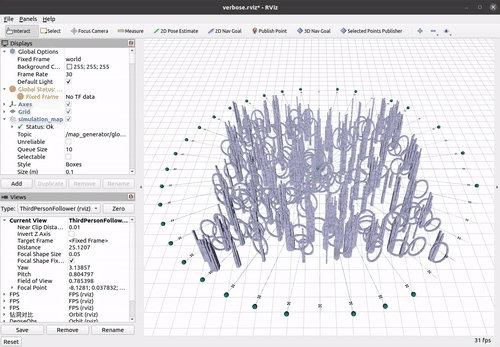
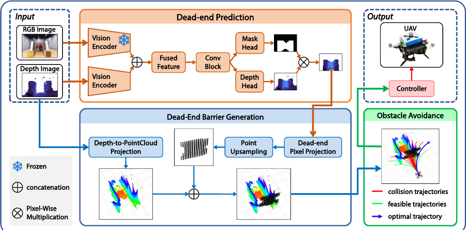
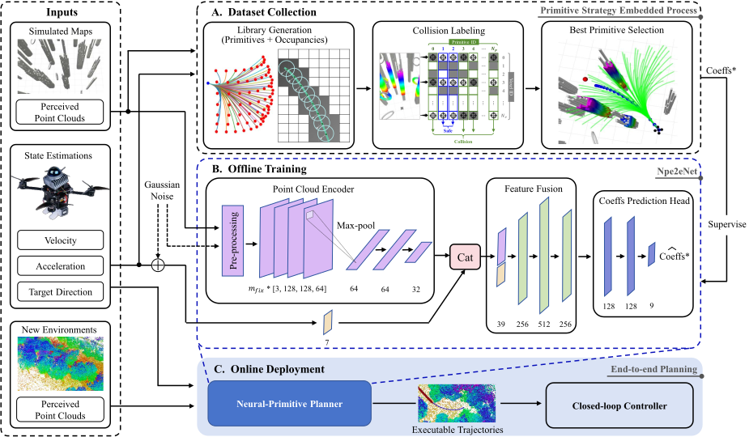

# Primitive_Planner

## Paper

Primitive-Swarm: An Ultra-lightweight and Scalable Planner for Large-scale Aerial Swarms, Accepted by IEEE Transactions on Robotics 2025. [[IEEE TRO]](https://ieeexplore.ieee.org/document/11015263) [[Arxiv]](https://arxiv.org/abs/2502.16887) [[Video]](https://www.bilibili.com/video/BV1Q4PNeeE7D?spm_id_from=333.788.videopod.episodes&vd_source=acac17792f24970ff76c5eae9ba38289&p=2)

Author list: Jialiang Hou, Xin Zhou, Neng Pan, Ang Li, Yuxiang Guan, Chao Xu, Zhongxue Gan, Fei Gao

```
@ARTICLE{Hou2025PrimitiveSwarm,
  author={Hou, Jialiang and Zhou, Xin and Pan, Neng and Li, Ang and Guan, Yuxiang and Xu, Chao and Gan, Zhongxue and Gao, Fei},
  journal={IEEE Transactions on Robotics}, 
  title={Primitive-Swarm: An Ultra-Lightweight and Scalable Planner for Large-Scale Aerial Swarms}, 
  year={2025},
  volume={41},
  number={},
  pages={3629-3648},
  keywords={Robots;Trajectory;Collision avoidance;Computational efficiency;Scalability;Planning;Libraries;Robot sensing systems;Drones;Heuristic algorithms;Autonomous aerial vehicles;collision avoidance;motion planning;swarm robotics;trajectory optimization},
  doi={10.1109/TRO.2025.3573667}}

```


## System Overview
<p align = "center">

</p>


## Requirements

The code is tested on clean Ubuntu 20.04 with ROS noetic installation.

Install the required package toppra:
```
sudo pip3 install toppra catkin_pkg PyYAML empy matplotlib pyrfc3339
```

## Run the code

### 1. Download and compile the code

```
git clone https://github.com/ZJU-FAST-Lab/Primitive-Planner.git
cd Primitive-Planner
catkin_make -DCMAKE_BUILD_TYPE=Release
```

### 2. Generate the motion primitive library

```
cd src/scripts
python3 swarm_path.py
```
The generated motion primitive library is stored in "src/planner/plan_manage/primitive_library/".

### 3. Run the planner

In the "Primitive-Planner/" directory:
```
source devel/setup.bash # or setup.zsh
cd src/scripts
python3 gen_position_swap.py 20 # It will generate the swarm.launch with 20 drones
roslaunch primitive_planner swarm.launch
```

Wait until all the nodes have their launch process finished and keep printing "[FSM]: state: WAIT_TARGET. Waiting for trigger".

Open another terminal, publish the trigger
```
cd src/scripts
bash pub_trigger.sh
```
Then the drones (drone number is 40) will start to fly like this
<p align = "center">

</p>

Change the drone number when executing "python3 gen_position_swap.py <drone_number>". 

Before starting the "roslaunch" command, please open another terminal and run "htop" to monitor the Memory usage and CPU usage. Each drone requires about 200 MB memory. Keep the htop opened for entire flight.

The computation time is printed on the terminal in blue text, named as "plan_time". 
To get the accurate computation time, please fix the CPU frequency to its maximum by
```
sudo apt install cpufrequtils
sudo cpufreq-set -g performance
```
Otherwise the CPU will run in powersave mode with low frequency.

## Projects Supported by Primitive-Swarm

- **DPNet: Efficient Dead-End Prediction and Avoidance for Vision-Based UAV Navigation**: DPNet combines dead-end prediction with a compact primitive library to proactively prune unsafe trajectories. [[Paper]](https://arxiv.org/abs/2608.16640)

 <p align="center">
    <a href="https://arxiv.org/abs/2608.16640" target="_blank">
      
    </a>
</p>

- **Neural-Primitive: An Efficient End-to-end Local Planner with Primitive-based Imitation Learning for Autonomous Flight**: It uses motion primitives as the structured representation for imitation learning, enabling end-to-end local planning for autonomous flight. [[Project]](https://zhitaoliu.github.io/neural-primitive/)

 <p align="center">
    <a href="https://zhitaoliu.github.io/neural-primitive/" target="_blank">
      
    </a>
</p>
